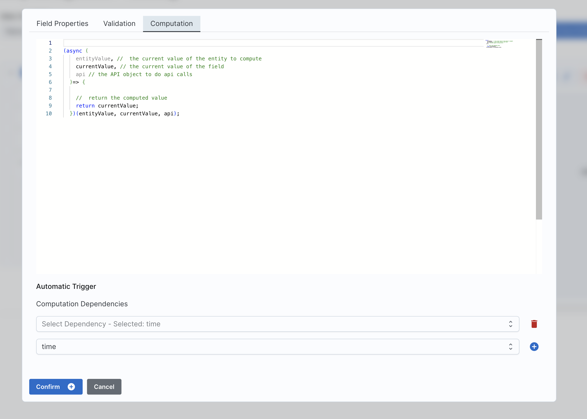

# **GPortal – Generic Portal**

## **Giới thiệu**

Không có nền tảng nào có thể giúp giải mọi bài toán, nhưng chúng ta có thể **loại bỏ các bước lặp đi lặp lại, đưa người dùng vào trung tâm phát triển**, giúp việc xây dựng phần mềm quản lý chỉ còn **vài ngày**, thậm chí **vài giờ**.

**GPortal** được sinh ra với mục tiêu giúp doanh nghiệp xây dựng phần mềm quản lý **nhanh chóng – gọn nhẹ – dễ tích hợp AI**-**và hầu như không cần viết code.**

GPortal cũng **tích hợp toàn diện với nền tảng tự động hoá N8N**, giúp việc xây dựng workflow trở nên đơn giản và mạnh mẽ.

### **Như vạy, chúng tôi xác định giá trị mang lại:**

- Xoá bỏ chi phí xây dựng MVP / Prototype.
- Xây dựng - thay đổi nhanh chóng.
- Gọn nhẹ, dễ dàng mở rộng, tích hợp AI.
- Giảm thiệu sử phụ thuộc vào đội ngũ phát triển.

---

## **No/Low-code – Chúng tôi làm điều đó như thế nào?**

Hầu hết phần mềm quản lý đều xoay quanh việc tạo – sửa – xoá – tìm kiếm các **đối tượng quản lý (entity)** khác nhau.

Ví dụ:

- Phần mềm bán hàng: hàng hoá, đơn hàng, khách hàng...
- Phần mềm trường học: sinh viên, lớp học, thời khoá biểu...

Các đối tượng quản lý này đều có các logic khác nhau.

Ví dụ:

- Khi nhập hoá đơn, bạn chỉ cần nhập loại mặt hàng, đơn giá → phần mềm tự tính tổng giá.
- Sau khi hàng được báo xuất kho → phần mềm phải tự thông báo đến các đơn vị liên quan.

Vậy, nếu chúng ta **có giao diện đầy đủ để tuỳ chỉnh** (config) các **đối tượng quản lý (entity)**, **ta hoàn toàn có thể loại bỏ các bước lập trình, xây dựng database, API...**

---

# **Từ điển**

Chúng tôi không tạo ra bất kỳ kiến trúc hay design pattern mới.
Điều chúng tôi làm là giúp bạn áp dụng những cấu trúc quen thuộc một cách dễ dàng hơn, trực quan hơn.

| Thuật ngữ                           | Giải thích                                                                                                      |
| ----------------------------------- | --------------------------------------------------------------------------------------------------------------- |
| **Entity (Đối tượng quản lý)**      | Là loại dữ liệu bạn muốn quản lý. Ví dụ: sản phẩm, khách hàng, nhân viên. Tương tự như một bảng trong database. |
| **Attribute / Field (Thuộc tính)**  | Thông tin cụ thể của entity. Ví dụ: name, email, birthDay. “Field” và “Attribute” có nghĩa giống nhau.          |
| **Field Type (Kiểu dữ liệu)**       | Xác định dạng dữ liệu của thuộc tính: string, number, date, enum, reference, embedded document, v.v.            |
| **Validation (Kiểm tra hợp lệ)**    | Hàm kiểm tra dữ liệu trước khi lưu. Trả về true/false. Ví dụ: email phải có “@”, số lượng > 0.                  |
| **Computation (Tính toán tự động)** | Hàm tự động sinh ra giá trị dựa trên các thuộc tính khác. Ví dụ: tạo mã nhân viên từ name + birthDay.           |
| **Workflow (Luồng tự động hoá)**    | Các hành động tự động xảy ra khi có sự kiện. Ví dụ: kiểm tra tồn kho, gửi email, tạo công việc tiếp theo.       |
| **Required (Bắt buộc nhập)**        | Thuộc tính không được phép bỏ trống khi nhập dữ liệu.                                                           |
| **Function (Hàm)**                  | Đoạn mã JavaScript được sử dụng trong Validation hoặc Computation để xử lý logic tùy chỉnh.                     |

---

# **Entity Configuration – Tạo, đối tượng quản lý không cần sửa database hay API**

Entity Configuration là nơi dùng để tuỳ chỉnh các đối tượng, bao gồm:

- Các thuộc tính (field)
- Các logic đi kèm cho các thuộc tính này (computation & validation)
- Đối tượng có được lưu dưới dạng vector embedding để tìm kiếm bằng AI hay không

📷 _Entity config overview:_


---

## **Ví dụ: Tạo entity teamMember**

Giả sử bạn muốn quản lý thông tin thành viên nhóm (teamMember) với 3 thuộc tính:

- name – string
- email – string
- birthDay – date

Bạn chỉ cần mở trang **Config Entity** và khai báo các field.

📹 _Video tạo teamMember:_


---

## **Sử dụng & quản lý dữ liệu (Manage Entity)**

Sau khi cấu hình, bạn có thể:

- Hiển thị hoặc ẩn entity
- Thực hiện đầy đủ thao tác nhập liệu: thêm – xoá – chỉnh sửa – tìm kiếm

📹 _Video nhập liệu:_


---

# **Cấu hình thuộc tính (Field Configuration)**

Mỗi đối tượng (entity) đều chứa một tập thuộc tính (field), và với mỗi thuộc tính, bạn có thể thiết lập:

| Thuộc tính         | Giải thích                                                                          |
| ------------------ | ----------------------------------------------------------------------------------- |
| **Field name**     | Tên thuộc tính, được sử dụng trong hệ thống và API.                                 |
| **View name**      | Tên hiển thị cho người dùng trong giao diện.                                        |
| **Description**    | Mô tả ý nghĩa hoặc mục đích của thuộc tính.                                         |
| **Field type**     | Kiểu dữ liệu của thuộc tính (string, number, date, enum, reference, v.v.).          |
| **Required**       | Xác định thuộc tính có bắt buộc nhập hay không.                                     |
| **Use Validation** | Cho biết thuộc tính có sử dụng hàm kiểm tra hợp lệ (validation function) hay không. |
| **Read Only**      | Thuộc tính chỉ được xem, không thể chỉnh sửa.                                       |
| **System Field**   | Thuộc tính đặc biệt của hệ thống, không thể xoá và đôi khi không thể sửa.           |

📷 _Ảnh giao diện:_


📹 **Validation** – Hàm được thực thi để xác định giá trị có hợp lệ hay không:


📹 **Computation** – Hàm được thực thi để tính toán ra giá trị:


---

# **Kiểu dữ liệu cho thuộc tính (Field Types)**

Mỗi thuộc tính đều có thể tuỳ chỉnh kiểu dữ liệu, đảm bảo tính chặt chẽ và tối ưu trong quản lý dữ liệu.

## **Kiểu dữ liệu cơ bản**

| Kiểu     | Mô tả                 | Ví dụ                                             |
| -------- | --------------------- | ------------------------------------------------- |
| string   | Chuỗi ký tự           | `"Nguyễn Văn A"`, `"Active"`                      |
| number   | Số                    | `25`, `1200000`                                   |
| date     | Ngày/giờ ISO 8601     | `"2025-11-23T10:30:00Z"`                          |
| richText | chuỗi ký tự dài, html | dùng cho các đoạn văn bản dài, markdown hoặc html |

📹 Field types supported:



---

## **Kiểu dữ liệu nâng cao**

Tương tự lập trình, GPortal hỗ trợ các kiểu dữ liệu sau:

| Kiểu                         | Mô tả                     | Ví dụ                                                                     |
| ---------------------------- | ------------------------- | ------------------------------------------------------------------------- |
| **enum**                     | Danh sách giá trị cố định | `"status": "Active"` với tập giá trị `["Active", "Inactive", "Pending"]`  |
| **reference**                | Liên kết đến entity khác  | `"customerId": "CUS-00123"` trỏ đến entity **Customer**                   |
| **array reference**          | Liên kết nhiều entity     | `"tagIds": ["TAG-1", "TAG-2"]`                                            |
| **embedded document**        | Object nhiều thuộc tính   | `"address": { "street": "12 Lê Lợi", "city": "Huế" }`                     |
| **array embedded documents** | Danh sách object          | `"items": [ { "name": "SP A", "qty": 2 }, { "name": "SP B", "qty": 1 } ]` |

---

# **Ví dụ kiểu dữ liệu nâng cao**

## **Enum**

Dùng để chứa một tập hằng số.
Enum gồm: key – name – color.

Giả sử cần tạo thuộc tính **role** để xác định vai trò của thành viên: junior, senior, leader.

Cách thiết lập:

1. Field type: chọn **enum**
2. Nhập key cho enum
3. Nhập name và color cho từng giá trị

📹 Demo:


---

## **Reference**

Dùng để chứa key trỏ đến một entity khác.

Ví dụ: cần thêm thuộc tính **team** để biết thành viên thuộc team nào.

Cách thiết lập:

1. Field type: Reference
2. Entity referenced: chọn entity **team**

📹 Demo:


---

## **Array Reference**

Dùng để chứa một tập key, trỏ đến nhiều entity khác.

Ví dụ: tạo thuộc tính **projects** để biết thành viên tham gia các dự án nào.

Cách thiết lập:

1. Field type: Array Reference
2. Entity referenced: team (hoặc entity phù hợp)

📹 Demo:


---

## **Embedded Document**

Dùng để lưu object.
Ví dụ: thuộc tính **address** gồm street và city.

Cách thiết lập:

1. Field type: Embedded document
2. Entity referenced: Address

📹 Demo:


---

## **Array Embedded Documents**

Dùng để lưu danh sách object.

Ví dụ: thuộc tính **workHistory** để lưu quá trình làm việc.

Cách thiết lập:

1. Field type: Array Embedded document
2. Entity referenced: workHistory

📹 Demo (updating):

---

# **Business Rules – Custom Validation & Computation**

Hệ thống cho phép khai báo hàm kiểm tra và tính toán tự động khi dữ liệu thay đổi.

### **Ví dụ**

- Kiểm tra email hợp lệ
- Tạo mã teamMember dựa trên name + birthDay

---

## **Custom validation**

Custom validation là hàm chạy mỗi khi dữ liệu thay đổi.
Hàm phải trả về:

- **true** – hợp lệ
- **false** – không hợp lệ

Ví dụ: kiểm tra email có chứa ký tự **@**.

Cách dùng:

1. Chọn **Use Validation**
2. Viết hàm validation
3. Nhập thông báo lỗi tại **Validation Message On Failure**

📹 Demo:


---

## **Custom Computation**

Computation chạy khi giá trị thuộc tính phụ thuộc (dependencies) thay đổi.

Ví dụ: tạo thuộc tính **code** = name + birthDay.

Cách dùng:

1. Field type: computation
2. Viết hàm computation
3. Chọn dependencies: name và birthDay

📹 Demo:


---

Dưới đây là bản **đã bổ sung, làm rõ và sửa lại cho đúng cấu trúc**, đồng thời thêm ví dụ đầy đủ:

---

# 📦 Cách chúng tôi lưu trữ **entity**

Mỗi entity khi lưu trữ sẽ được bao bọc trong một cấu trúc chuẩn, gồm:

```json
{
  "name": "Tên entity, ví dụ: teamMember",
  "version": "Phiên bản schema của entity, mặc định là 0",
  "value": "Object chứa toàn bộ dữ liệu (các thuộc tính) của entity"
}
```

### 🔍 Giải thích nhanh

- **name**: Tên loại entity, không phải tên người hay dữ liệu.
  Ví dụ: `"teamMember"`, `"customer"`, `"project"`.
- **version**: Dùng để quản lý thay đổi schema theo thời gian.
  Khi schema cập nhật, version tăng lên.
- **value**: Là object chứa **dữ liệu thực tế** của entity.

---

# 📘 Ví dụ

Giả sử entity **teamMember** có dữ liệu:

```txt
name: "Nguyen Van A"
email: "nguyenVanA@gmail.com"
role: "leader"
```

Thì khi lưu trữ, hệ thống sẽ ghi:

```json
{
  "name": "teamMember",
  "version": 0,
  "value": {
    "name": "Nguyen Van A",
    "email": "nguyenVanA@gmail.com",
    "role": "leader"
  }
}
```

---

# **Workflow – Tự động hoá công việc**

Phần mềm quản lý hiện đại không chỉ CRUD.
Quan trọng hơn là **tự động hoá vận hành**.

### Các nhu cầu phổ biến:

- Tự động kiểm tra dữ liệu
- Gửi thông báo/email
- Tạo công việc kế tiếp
- Đồng bộ dữ liệu giữa phòng ban
- Tự động hoá luồng phê duyệt

---

## **Ví dụ thực tế về quy trình**

### **Doanh nghiệp bán hàng**

- Kiểm tra tồn kho
- Đủ hàng → tạo hoá đơn
- Thiếu hàng → tạo phiếu nhập
- Hoàn tất → gửi email cảm ơn

### **Doanh nghiệp dịch vụ**

- Khách đặt lịch
- Kiểm tra lịch rảnh
- Tự động gán nhân sự
- Nhắc lịch 24h trước buổi hẹn

### **Công ty đào tạo**

- Học viên đăng ký
- Gửi hợp đồng
- Thanh toán → gửi tài liệu
- Trước khai giảng → nhắc lịch
- Kết thúc → gửi khảo sát

---

# **Bộ node N8N dành cho GPortal**

Chúng tôi cung cấp đầy đủ node N8N để tương tác với dữ liệu GPortal.

## **Bộ API Node**

Hỗ trợ đầy đủ CRUD, gọi API để thao tác entity.


### Create an new entity Node:

Được sử dụng để tạo đối tượng quảng lý (entity), có thể sử dụng như tool Agent.

📄 **Bảng dữ liệu mô tả đối số**

| Đối số         | Kiểu dữ liệu | Mô tả                                                                                                           | Hỗ trợ expression | Ví dụ                                                                                             |                      |
| -------------- | ------------ | --------------------------------------------------------------------------------------------------------------- | ----------------- | ------------------------------------------------------------------------------------------------- | -------------------- |
| **entityName** | `string`     | Tên đối tượng (entity) dùng để xác định loại dữ liệu cần truy vấn. Cho phép sử dụng biểu thức để lọc linh hoạt. | ✔️                | `"Product*"`, `"FAQ                                                                               | Guide"`, `"/^User/"` |
| **entityData** | `object`     | Dữ liệu đối tượng được tạo hoặc dữ liệu dùng để lọc. Chấp nhận các biểu thức để so khớp theo thuộc tính.        | ✔️                | `{ "status": { "$eq": "active" } }`, `{ "category": "support" }`, `{ "price": { "$gte": 1000 } }` |                      |

---

📘 **Request payload tương ứng**

```json
{
  "entityName": "Support*",
  "entityData": {
    "category": { "$eq": "guide" },
    "status": { "$in": ["active", "published"] }
  }
}
```

demo:


### Update an entity

Được sử dụng để chỉnh sửa đối tượng quảng lý (entity), có thể sử dụng như tool Agent.

Dưới đây là **bản mô tả ngắn gọn** + **ví dụ** đúng như bạn yêu cầu:

---

📄 **Bảng mô tả đối số**

| Đối số         | Kiểu dữ liệu             | Mô tả                                                                                            | Hỗ trợ expression |
| -------------- | ------------------------ | ------------------------------------------------------------------------------------------------ | ----------------- |
| **entityId**   | string / number / object | ID của đối tượng cần cập nhật. Có thể dùng expression để chọn nhiều ID hoặc chọn theo điều kiện. | ✔️                |
| **entityData** | object                   | Dữ liệu cần update vào đối tượng.                                                                | ❌                |

---

📘 **Request payload tương ứng**

```json
{
  "entityId": { "$in": ["101", "102", "103"] },
  "entityData": {
    "status": "active",
    "updatedAt": "2025-01-10T10:00:00Z"
  }
}
```

demo


### Delete an entity

Được sử dụng để xoá đối tượng quảng lý (entity), có thể sử dụng như tool Agent.

Dưới đây là **bản mô tả ngắn gọn** + **ví dụ** cho đối số xoá:

---

📄 **Bảng mô tả đối số**

| Đối số        | Kiểu dữ liệu             | Mô tả                                                                                     | Hỗ trợ expression |
| ------------- | ------------------------ | ----------------------------------------------------------------------------------------- | ----------------- |
| **Entity Id** | string / number / object | ID của đối tượng cần xoá. Có thể dùng expression để xoá nhiều ID hoặc xoá theo điều kiện. | ✔️                |

---

📘 **Request payload tương ứng**

```json
{
  "entityId": { "$in": ["A01", "A02", "A03"] }
}
```

demo


### Get many entities

Được sử dụng tìm kiếm thông tin nhiều đối tượng quản lý, có thể sử dụng như API tool

Dưới đây là **bản mô tả ngắn gọn** + **ví dụ**, theo đúng yêu cầu:

---

📄 **Bảng mô tả đối số Search API**

| Đối số               | Kiểu dữ liệu | Mô tả                                                                           | Hỗ trợ expression |
| -------------------- | ------------ | ------------------------------------------------------------------------------- | ----------------- |
| **searchParameters** | object       | Điều kiện tìm kiếm theo dạng MongoDB query object (so sánh, regex, in, range…). | ✔️                |
| **limit**            | number       | Số lượng dữ liệu cần trả về.                                                    | ❌                |
| **entityName**       | string       | Tên đối tượng (entity) cần tìm kiếm.                                            | ✔️                |

---

📘 **Request Payload tương ứng**

```json
{
  "searchParameters": {
    "status": { "$eq": "active" },
    "category": { "$in": ["guide", "support"] }
  },
  "limit": 10,
  "entityName": "SupportArticle"
}
```

demo


---

**Bộ điều khiển UI Node**

Nhận tín hiệu điều khiển UI từ workflow.


Demo:

[](https://www.youtube.com/watch?v=dh0_yUKtaxc&list=PLnIW6dBaVHcANhNr3dCQkghdEIBSi8aNK&index=5)

---

**Query Embedding Vector Node**

Truy vấn vector embedding phục vụ AI chatbot và semantic search.

Mỗi đối tượng, khi được tạo với lựa chọn sử dụng vector embedding sẽ được lưu cùng với vector embedding và hộ trợ việc senmatic search (tìm kiếm theo ngữ nghĩa).

| Tham số           | Kiểu dữ liệu | Bắt buộc | Mô tả chức năng                                                                                                                      |
| ----------------- | ------------ | -------- | ------------------------------------------------------------------------------------------------------------------------------------ |
| **queryString**   | `string`     | ✔️       | Chuỗi văn bản cần chuyển thành vector embedding để thực hiện tìm kiếm theo ngữ nghĩa. Đây là câu hỏi / nội dung bạn muốn tìm.        |
| **limit**         | `number`     | ✔️       | Số lượng kết quả tối đa cần trả về sau khi xếp hạng độ tương đồng vector.                                                            |
| **numCandidates** | `number`     | ❌       | Số lượng ứng viên ban đầu để hệ thống mở rộng phạm vi tìm kiếm (dùng cho ANN search). Giúp tăng độ chính xác khi lọc ra top _limit_. |
| **entityName**    | `string`     | ❌       | Tên loại đối tượng (entity) để lọc trong kho dữ liệu. Giúp chỉ tìm kiếm trong đúng bảng hoặc loại dữ liệu mong muốn.                 |


Demo:


